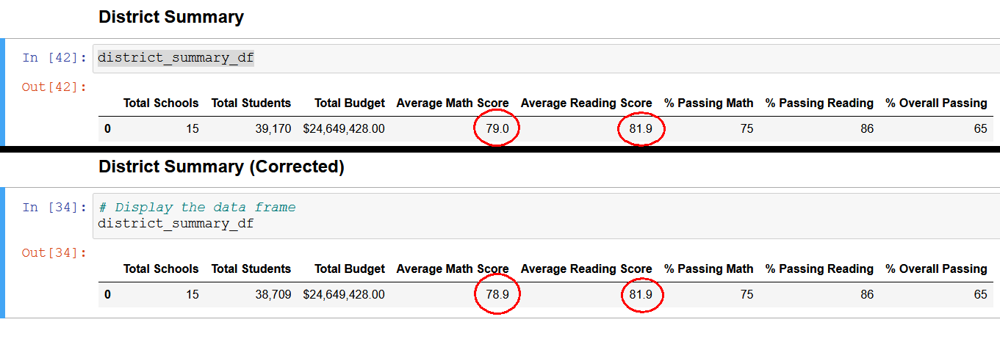
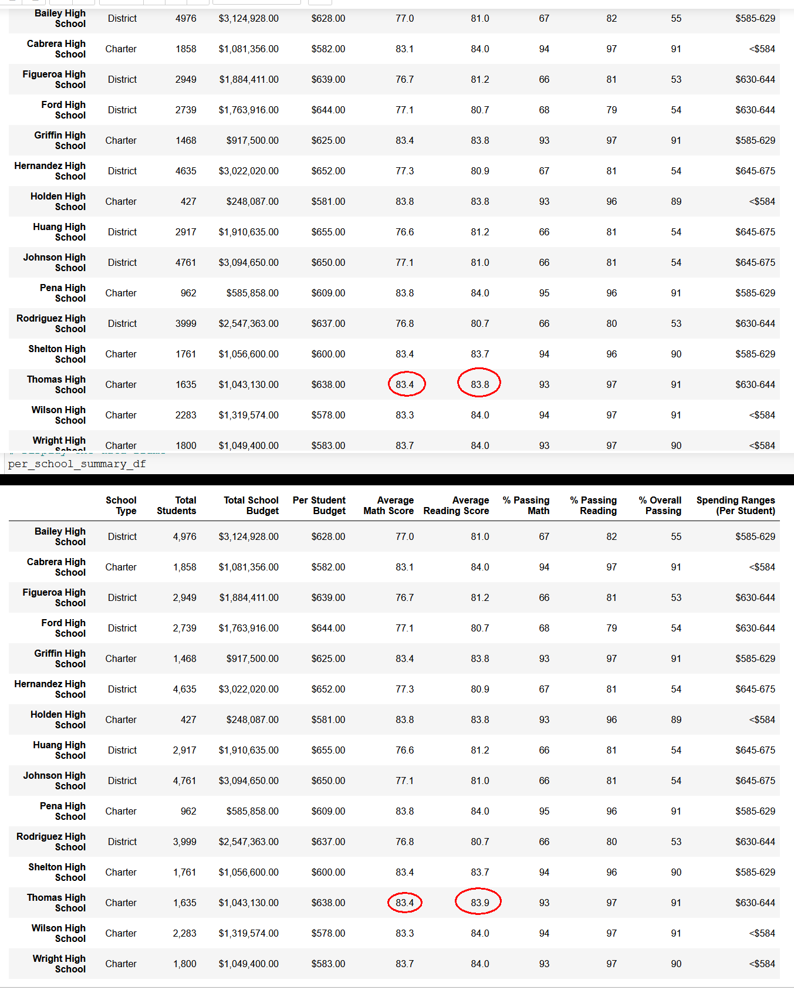
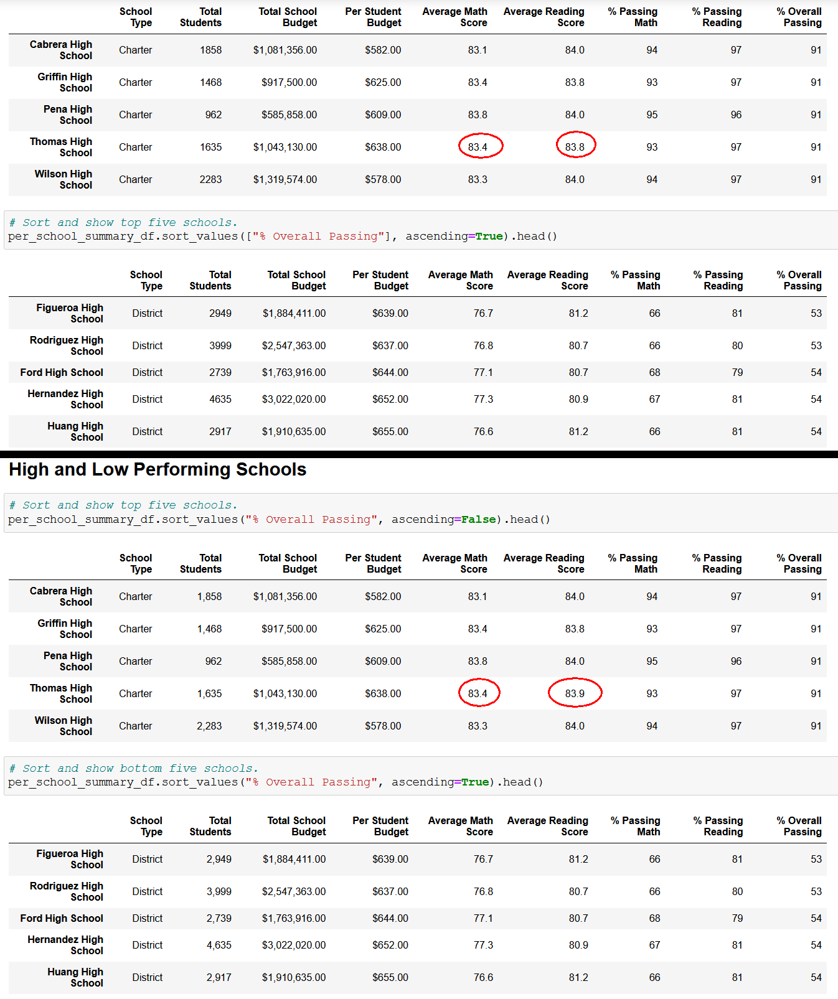
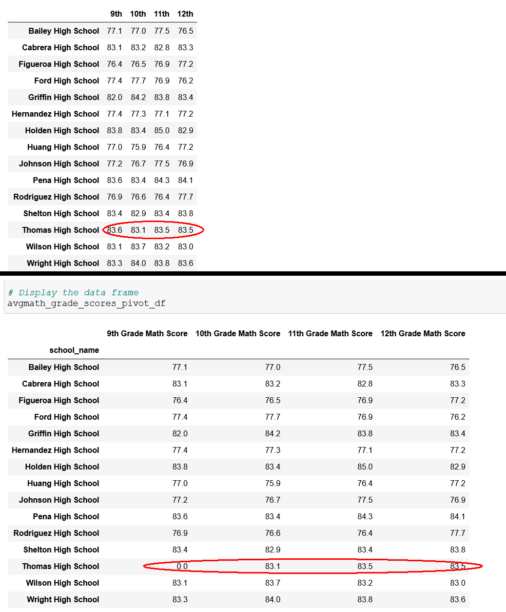
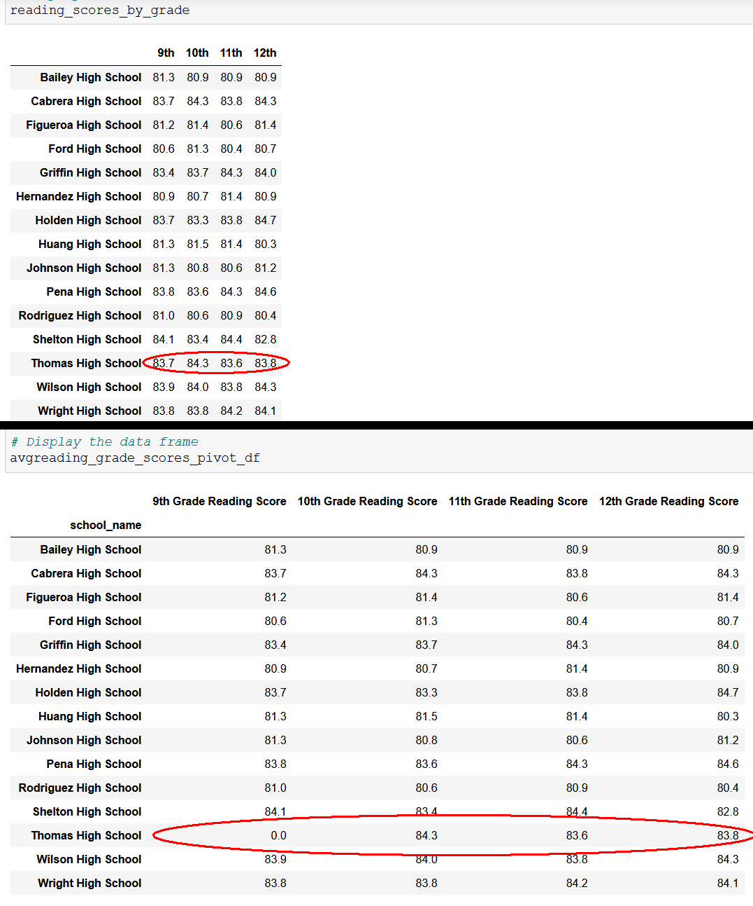
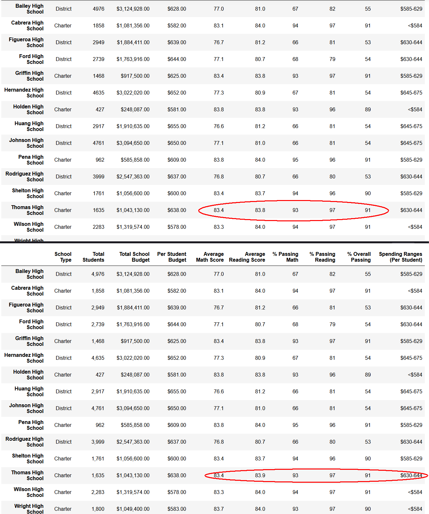
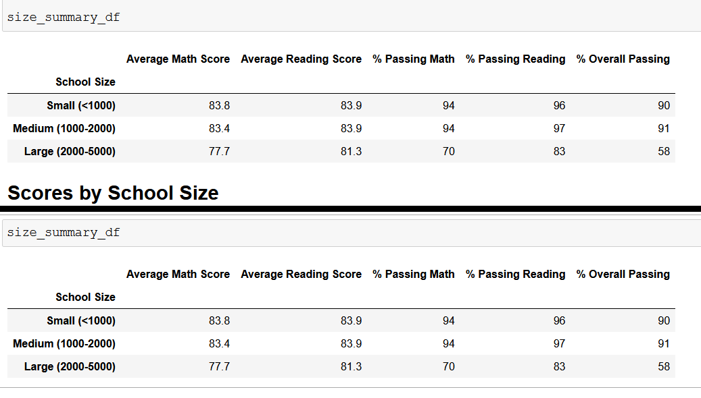
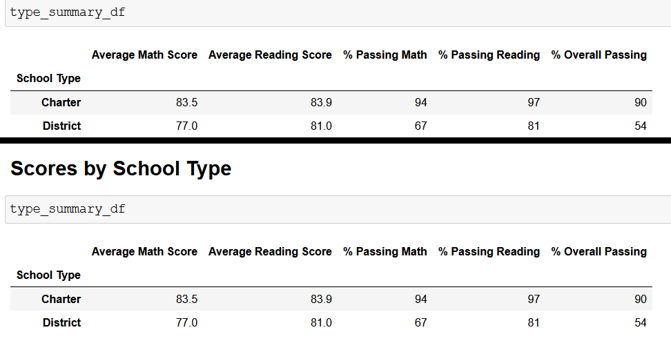

# Analysis of School District ABC and how removing tampered scores affects analysis outcome.

### Implementation of requested changes
Python can be used to summarize the School Districts metrics (Math Scores and Reading Scores) multiple ways to draw correlations such as, how does school size, school budget, and school type affect said metrics.  Specific to this Analysis is an incident of unauthorized alterations made to the Math and Reading scores for Thomas High School. These scores have been replaced with NaNs(Not a Number) as requested with the following code
```
student_data_df.loc[(student_data_df["school_name"]=="Thomas High School") & (student_data_df["grade"]=="9th"),"math_score"] = np.nan
```
After removing these scores, the summaries had to be recalculated.  
In order to perform the requested adjustments, code changes were implemented (shown below)
1. Get an adjusted student count
<!-- code -->
```
# Subtract the number of students that are in ninth grade at 
# Thomas High School from the total student count to get the new total student count.
adj_student_count = student_count - students_nograde
```
<!-- end code -->

2. Recalculate passing averages with adjusted student count.
<!-- code -->
```
# Calculate the passing percentages with the new total student count.
passing_math_percentage = passing_math_count / adj_student_count * 100
passing_reading_percentage = passing_reading_count / adj_student_count * 100
# Calculate the students who passed both reading and math.
passing_math_reading = school_data_complete_df[(school_data_complete_df["math_score"] >= passing_grade) & (school_data_complete_df["reading_score"] >= passing_grade)]
# Calculate the number of students that passed both reading and math.
overall_passing_math_reading_count = passing_math_reading["student_name"].count()
# Calculate the overall passing percentage with new total student count.
overall_passing_percentage = overall_passing_math_reading_count / adj_student_count * 100
```
<!-- end code -->

3. Get the dataframe that is Thomas High School, but NOT the removed scores.
<!-- code -->
```
# Get the number of 10th-12th graders from Thomas High School (THS).
THS_df = school_data_complete_df[(school_data_complete_df["school_name"] == "Thomas High School") 
                        & pd.notna(school_data_complete_df["reading_score"])]
```
<!-- end code -->


4. Using this THS(Thomas High School) dataframe perform calculations 
<!-- code -->
```
per_THS_counts = THS_df.count()["student_name"]
# Get all the students passing math from THS
THS_passing_math = THS_df[(THS_df["math_score"]>=passing_grade)]
# Get all the students passing reading from THS
THS_passing_reading = THS_df[(THS_df["reading_score"]>=passing_grade)]
# Get all the students passing math and reading from THS
THS_passing_overall = THS_df[(THS_df["math_score"]>=passing_grade)&(THS_df["reading_score"]>=passing_grade)]
# Calculate the percentage of 10th-12th grade students passing math from Thomas High School. 
THS_passing_math_percentage = (THS_passing_math.count()["student_name"] / per_THS_counts)*100
# Calculate the percentage of 10th-12th grade students passing reading from Thomas High School.
THS_passing_reading_percentage = (THS_passing_reading.count()["student_name"] / per_THS_counts)*100
# Calculate the overall passing percentage of 10th-12th grade from Thomas High School. 
THS_passing_overall_percentage = (THS_passing_overall["student_name"].count() / per_THS_counts)*100
# Replace the passing math percent for Thomas High School in the per_school_summary_df.
per_school_summary_df.loc["Thomas High School","% Passing Math"] = THS_passing_math_percentage
# Replace the passing reading percentage for Thomas High School in the per_school_summary_df.
per_school_summary_df.loc["Thomas High School","% Passing Reading"] = THS_passing_reading_percentage
# Replace the overall passing percentage for Thomas High School in the per_school_summary_df.
per_school_summary_df.loc["Thomas High School","% Overall Passing"] = THS_passing_overall_percentage
```
<!-- end code -->


### Resulting differences in Analysis measurements

In the following 7 images, the old summary is above, and the new is below.

Image 01_District_Summary_DataFrame

Image 02_School_Summary_DataFrame

Image 03_04_High_and_Low_Performing_Schools

Image 05_Average_Math_Score_Summary

Image 06_Average_Reading_Score_Summary

Image 07_Student_Scores_by_School_Spending

Image 08_Scores_by_School_Size

Image 09_Scores_by_School_Type


### Summary of differences in Analysis measurements
Four Distinct differences can be summarized as follows:
1. District Summary: Average Math Score; From 79.0 to 78.9
<BR>&nbsp;&nbsp;&nbsp;[also not highlighted, but here it shows student count goes from 39,170 to 38,709(a decrease of 461 or 1.1769%]
2. School Summary: Thomas High School (Average Reading Score); From 83.8 to 83.9
3. High and Low Performing: Thomas High School (Average Reading Score); From 83.8 to 83.9
4. Student Scores by School Spending (Thomas High School/Math); From 83.8 to 83.9

Additional points of less importance:
<BR>&nbsp;&nbsp;&nbsp;5. Average MATH Score by HS/Grade (Thomas High School); From 83.6 to =0= (This is expected, these are the removed scores)
<BR>&nbsp;&nbsp;&nbsp;6. Average READING Score by HS/Grade (Thomas High School); From 83.7 to =0= (This is expected, these are the removed scores)
<BR>&nbsp;&nbsp;&nbsp;7. No change was apparent in the Score by School Size
<BR>&nbsp;&nbsp;&nbsp;8. No change was apparent in the Score by School Type

